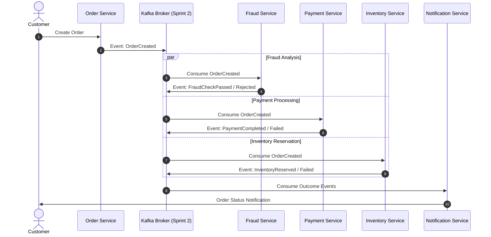

# StreamForge Event Flow

## High-Level Event Lifecycle

StreamForge relies on asynchronous event choreographies and sagas across microservices.

## Sprint Progression
- **Sprint 1 (Current):** Foundation, packaging, code quality gates, PostgreSQL 17, and health/readiness endpoints.
- **Sprint 2:** Kafka cluster configuration, event schema definitions, base publisher/consumer abstractions.
- **Sprint 3+:** Saga execution, transactional outbox pattern, real-time analytics.
